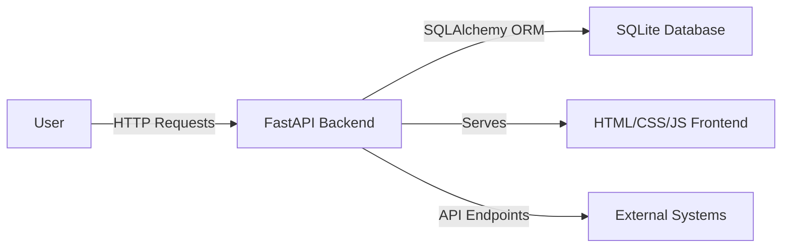

# Cybersecurity Threat Detector Using Machine Learning

## Overview
The **Cybersecurity Threat Detector Using Machine Learning** is a robust application designed to monitor, detect, and manage cybersecurity threats in real-time. This project leverages machine learning techniques to identify potential threats such as malware and phishing attempts, providing users with a comprehensive dashboard to view and analyze these threats. The application is ideal for cybersecurity professionals, IT administrators, and organizations looking to enhance their security posture with automated threat detection and analysis.

The application offers a user-friendly interface built with FastAPI, allowing users to view threats, user activity logs, and network traffic data. It also provides RESTful API endpoints for seamless integration with other systems. The backend is powered by a SQLite database, ensuring efficient data storage and retrieval.

## Features
- **Real-Time Threat Detection**: Automatically detect and categorize threats such as malware and phishing attempts.
- **User Activity Logging**: Track and log user activities for auditing and analysis.
- **Network Traffic Monitoring**: Monitor network traffic to identify suspicious activities.
- **Comprehensive Dashboard**: User-friendly interface displaying threats, logs, and network data.
- **RESTful API**: Access data programmatically via API endpoints for integration with other systems.
- **Settings Management**: Configure application settings through a dedicated interface.
- **Responsive Design**: Mobile-friendly interface for monitoring on-the-go.

## Tech Stack
| Component       | Technology         |
|-----------------|--------------------|
| Backend         | FastAPI            |
| Frontend        | HTML, CSS, JavaScript |
| Database        | SQLite             |
| ORM             | SQLAlchemy         |
| Templating      | Jinja2             |
| Web Server      | Uvicorn            |
| Containerization| Docker             |

## Architecture
The application architecture consists of a FastAPI backend serving a frontend built with HTML, CSS, and JavaScript. The backend communicates with a SQLite database using SQLAlchemy ORM to manage data related to threats, user activities, and network traffic. The application provides both web-based interfaces and RESTful API endpoints for data access.



## Getting Started

### Prerequisites
- Python 3.11+
- pip (Python package manager)
- Docker (optional, for containerized deployment)

### Installation
1. Clone the repository:
   ```bash
   git clone https://github.com/yourusername/cybersecurity-threat-detector-using-machine-learni-auto.git
   cd cybersecurity-threat-detector-using-machine-learni-auto
   ```
2. Create a virtual environment:
   ```bash
   python -m venv env
   source env/bin/activate  # On Windows use `env\Scripts\activate`
   ```
3. Install the required packages:
   ```bash
   pip install -r requirements.txt
   ```

### Running the Application
1. Start the FastAPI server:
   ```bash
   uvicorn app:app --reload
   ```
2. Open your browser and visit `http://localhost:8000` to access the dashboard.

## API Endpoints
| Method | Path                 | Description                                |
|--------|----------------------|--------------------------------------------|
| GET    | /api/threats         | Retrieve all detected threats              |
| GET    | /api/logs            | Retrieve user activity logs                |
| GET    | /api/network         | Retrieve network traffic data              |
| POST   | /api/settings        | Update application settings                |
| GET    | /api/system-health   | Check system health status                 |

## Project Structure
```
cybersecurity-threat-detector-using-machine-learni-auto/
├── app.py                  # Main application file
├── Dockerfile              # Docker configuration
├── requirements.txt        # Python dependencies
├── start.sh                # Start script for deployment
├── static/
│   ├── css/
│   │   └── style.css       # Styles for the frontend
│   └── js/
│       └── main.js         # JavaScript for frontend interactions
└── templates/
    ├── dashboard.html      # Dashboard page template
    ├── logs.html           # Logs page template
    ├── network.html        # Network traffic page template
    ├── settings.html       # Settings page template
    └── threats.html        # Threats page template
```

## Screenshots
*Screenshots of the application interface will be placed here.*

## Docker Deployment
To deploy the application using Docker, follow these steps:
1. Build the Docker image:
   ```bash
   docker build -t cybersecurity-threat-detector .
   ```
2. Run the Docker container:
   ```bash
   docker run -d -p 8000:8000 cybersecurity-threat-detector
   ```

## Contributing
Contributions are welcome! Please fork the repository and submit a pull request with your changes. Ensure that your code adheres to the project's coding standards and includes appropriate tests.

## License
This project is licensed under the MIT License. See the LICENSE file for details.

---
Built with Python and FastAPI.